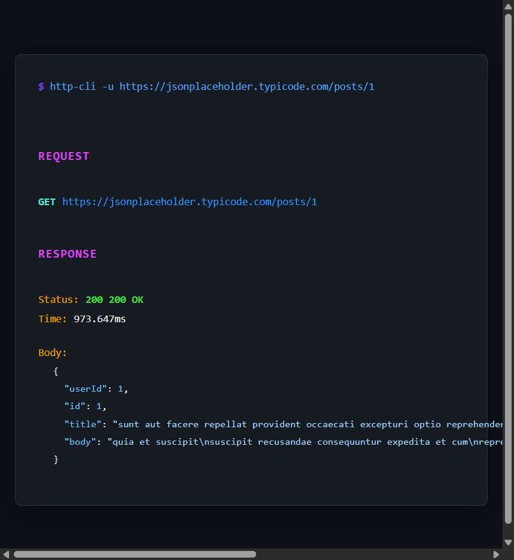

# HTTP CLI

A colorful, lightweight command-line HTTP client similar to Postman. Built with Go for fast performance and beautiful terminal output.

## Features

- 🎨 **Colorful output** - Beautiful, easy-to-read terminal colors
- ⚡ **Fast** - Single binary, no dependencies
- 🧹 **Clean interface** - Not crowded, just the essentials
- 📡 **All HTTP methods** - GET, POST, PUT, DELETE, PATCH
- 📦 **JSON support** - Automatic JSON formatting
- ⏱️ **Customizable** - Headers, body, timeout
- 🔐 **Authentication** - Bearer tokens and Basic auth shortcuts
- 📁 **File support** - Read request body from file, save response to file
- 🔄 **Redirects** - Control redirect following
- 🎯 **Output modes** - Quiet mode, status-only, verbose mode

## Screenshot

Here's what the tool looks like in action:



**Example Command:**
```bash
$ http-cli -u https://jsonplaceholder.typicode.com/posts/1
```

**Visual Color Scheme:**
- 🟣 **Purple** - Section headers (`REQUEST`, `RESPONSE`)
- 🔵 **Cyan** - HTTP methods (`GET`, `POST`, `PUT`, `DELETE`, `PATCH`)
- 🔵 **Blue** - URLs
- 🟢 **Green** - Success status codes (2xx)
- 🟡 **Yellow** - Redirect status codes (3xx)
- 🔴 **Red** - Error status codes (4xx/5xx)
- 🟠 **Orange** - Keys (`Headers`, `Body`, `Status`, `Time`)
- ⚪ **Light Gray** - Values and JSON content

> 💡 **Tip:** The actual terminal output is beautifully colored with syntax highlighting. Authorization headers are automatically masked for security (use `-v` to see full values in verbose mode).

## Installation

### Build from source

```bash
go mod download
go build -o http-cli main.go
```

### Or run directly

```bash
go run main.go [options]
```

## Usage

### Basic GET request

```bash
http-cli -u https://api.github.com/users/octocat
```

### POST request with JSON body

```bash
http-cli -m POST -u https://api.example.com/users -d '{"name":"John","email":"john@example.com"}'
```

### POST from file

```bash
http-cli -m POST -u https://api.example.com/users -f body.json
```

### With Bearer token

```bash
http-cli -u https://api.example.com/data -b "your-token-here"
```

### With Basic authentication

```bash
http-cli -u https://api.example.com/data -a "username:password"
```

### With custom headers

```bash
http-cli -m GET -u https://api.example.com/data -H "Accept:application/json,X-Custom-Header:value"
```

### Save response to file

```bash
http-cli -u https://api.example.com/data -o response.json
```

### Quiet mode (only response body)

```bash
http-cli -u https://api.example.com/data -q
```

### Status only

```bash
http-cli -u https://api.example.com/data -s
```

### Verbose mode (show all details)

```bash
http-cli -u https://api.example.com/data -v
```

### PUT request

```bash
http-cli -m PUT -u https://api.example.com/users/1 -d '{"name":"Jane"}' -H "Content-Type:application/json"
```

### DELETE request

```bash
http-cli -m DELETE -u https://api.example.com/users/1
```

## Options

| Flag | Long Form | Description |
|------|-----------|-------------|
| `-m` | `--method` | HTTP method (default: GET) |
| `-u` | `--url` | URL to request (required) |
| `-d` | `--data` | Request body (JSON string) |
| `-f` | `--file` | Read request body from file |
| `-H` | `--header` | Headers (format: 'Key:Value,Key2:Value2') |
| `-b` | `--bearer` | Bearer token (sets Authorization header) |
| `-a` | `--auth` | Basic auth (format: 'user:pass') |
| `-o` | `--output` | Save response body to file |
| `-t` | `--timeout` | Request timeout in seconds (default: 30) |
| `-L` | `--follow` | Follow redirects |
| `-q` | `--quiet` | Quiet mode (only show response body) |
| `-v` | `--verbose` | Verbose mode (show all details) |
| `-s` | `--status-only` | Show only status code |

## Examples

### GitHub API

```bash
http-cli -u https://api.github.com/users/octocat
```

### JSONPlaceholder API

```bash
# GET all posts
http-cli -u https://jsonplaceholder.typicode.com/posts

# GET specific post
http-cli -u https://jsonplaceholder.typicode.com/posts/1

# POST new post
http-cli -m POST -u https://jsonplaceholder.typicode.com/posts \
  -d '{"title":"My Post","body":"Content","userId":1}' \
  -H "Content-Type:application/json"
```

## Output

The tool displays:
- **Request** section with method, URL, headers, and body
- **Response** section with status code, time, headers, and formatted body
- Color-coded status codes (green for 2xx, yellow for 3xx, red for 4xx/5xx)
- Automatic JSON pretty-printing
- Sensitive headers (Authorization) are masked by default (use `-v` to see full values)

## Output Modes

- **Default**: Shows request and response with all details
- **Quiet (`-q`)**: Only shows the response body (useful for piping)
- **Status-only (`-s`)**: Only shows the HTTP status code
- **Verbose (`-v`)**: Shows additional details like response size and all headers

## License

MIT

